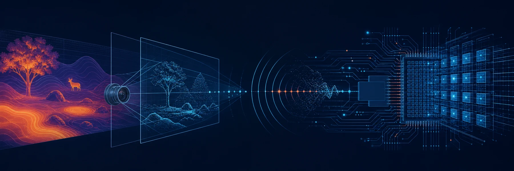

  

  <h1>张恒玮 · Hengwei Zhang</h1>

  
<strong>Electronic Information Engineering @ Beijing Institute of Technology</strong>

  
多模态感知 · Embedded AI · FPGA · AI-native Products

  

    
    
    
  

## 👋 关于我 / About

我在北京理工大学学习电子信息工程，关注如何把感知算法真正放进系统里：从视觉、红外和毫米波雷达获取现实信号，在嵌入式平台或 FPGA 上完成处理，再把结果组织成能被人使用的 AI 产品。

I enjoy building across the whole path:

<code>Sensing → Edge Computing → Decision → Interaction</code>

## 🧭 技术坐标 / Focus

| 方向 | 我在做什么 |
|---|---|
| **多模态感知** | PyTorch、目标检测、红外热成像、毫米波雷达、语音与视觉分析 |
| **嵌入式 AI** | ARM Cortex-A、飞腾平台、ESP32、树莓派、Linux 与交叉编译 |
| **FPGA / 数字系统** | Verilog、Vivado / Quartus Prime、VGA 图形、AXI-Stream |
| **AI 产品工程** | FastAPI、React / Vite、LLM / RAG、实时多模态管线 |

## 🚀 代表项目 / Selected Work

<table>
  <tr>
    <td width="50%" valign="top">
      <h3><a href="https://github.com/vivofiftykfc/cicc_9">火灾救援无人机</a></h3>
      
<strong>视觉与感知模块负责人</strong>

      
打通视觉、红外与通信数据流；将 NanoDet 经 ncnn 部署到飞腾平台，并基于 MLX90640 设计火灾预警与火源定位算法。

      
🏆 集创赛飞腾赛道 · 华北赛区二等奖

    </td>
    <td width="50%" valign="top">
      <h3><a href="https://github.com/vivofiftykfc/qwen_rag">独居老人健康监测</a></h3>
      
<strong>核心开发成员</strong>

      
独立完成毫米波雷达感知模块，设计雷达与视觉融合判据，并用大语言模型把多传感器结果组织成自然语言决策链。

      
📜 北京市市级创新项目 · 已授权发明专利

    </td>
  </tr>
  <tr>
    <td width="50%" valign="top">
      <h3><a href="https://github.com/vivofiftykfc/judgebooth">JudgeBooth</a></h3>
      
<strong>后端与 AI 管线开发</strong>

      
基于 FastAPI / SSE 编排语音识别、面部分析、LLM 评审、语音合成和 AI 生图，完成从路演输入到评审报告与纪念合影的实时链路。

    </td>
    <td width="50%" valign="top">
      <h3><a href="https://github.com/vivofiftykfc/sound-walker">Sound-Walker</a></h3>
      
<strong>嵌入式离线声纹识别</strong>

      
在 ARM Linux 平台比较 MFCC + DTW 纯 C 方案与 CAM++ / sherpa-onnx 神经网络方案，探索端侧识别的精度与资源权衡。

    </td>
  </tr>
  <tr>
    <td width="50%" valign="top">
      <h3><a href="https://github.com/vivofiftykfc/StellarVanguard-FPGA">StellarVanguard-FPGA</a></h3>
      
<strong>纯硬件 VGA 射击游戏</strong>

      
在 Basys3 / Artix-7 上使用 Verilog 实现 9 层渲染管线、敌机波次、星空与 HUD，输出 640×480 @ 60 Hz VGA 画面。

    </td>
    <td width="50%" valign="top">
      <h3><a href="https://github.com/vivofiftykfc/wlan-0714-arg">WLAN-0714 ARG</a></h3>
      
<strong>可完整通关的中文互联网 ARG</strong>

      
围绕“已注销账号仍在夜间登录”构建真相时间线、证据关系、解谜门槛与持久化状态，把叙事设计落实为可玩的 Web 体验。

    </td>
  </tr>
</table>

## 🎓 教育与荣誉 / Education & Recognition

- **北京理工大学** · 电子信息工程本科（2023–2027）
- **全国大学生集成电路创新创业大赛** · 飞腾赛道华北赛区二等奖
- **美国大学生数学建模竞赛 MCM/ICM** · Honorable Mention
- **北京市市级创新项目**结项 · 授权发明专利一项

  
<strong>更多项目与技术实践</strong>

   

- [fpga-busicdc-2025](https://github.com/vivofiftykfc/fpga-busicdc-2025) — AXI-Stream 网络协议解析与 8 位单总线处理器
- [ARG Toolbox](https://github.com/vivofiftykfc/arg-toolbox) — 将故事真相、角色知识与玩家知识编译成可验证的 ARG Story IR
- [Contemplation Site](https://github.com/vivofiftykfc/contemplation-site) — 一键生成沉浸式交互阅读网站
- [个人博客](https://vivofiftykfc.github.io/) — 学习笔记、技术体系与关于现实问题的长期思考

---

  <em>把现实问题压缩成模型，再把模型送回现实里检验。</em>

